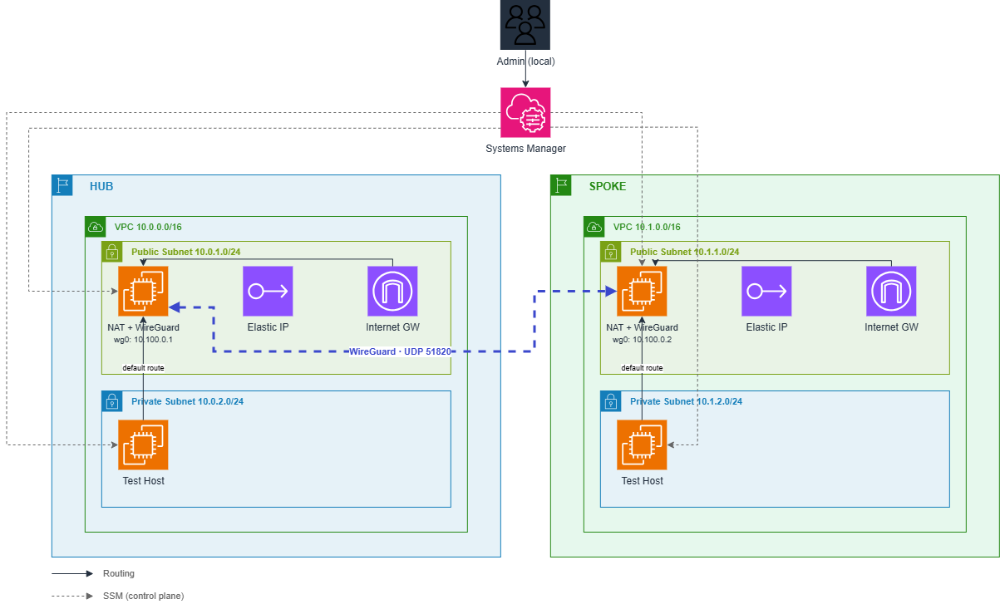

# NetFabric

Multi-region network lab on AWS: two VPCs connected by a self-managed WireGuard tunnel, with NAT, routing and admin access built by hand instead of relying on AWS managed networking services.

## Why this exists

Multi-region AWS networking is usually done with managed services: NAT Gateway, Site-to-Site VPN, Transit Gateway. Those work, but they hide the mechanics — NAT/MASQUERADE, key exchange, routing tables, stateless NACLs — behind a checkbox. NetFabric rebuilds the core pieces manually to actually understand and control that layer. Lower cost is a side effect of that choice, not the primary goal.

Note on naming: the Terraform environments are called `hub` and `spoke`. With exactly two VPCs this is a naming convention, not a real hub-spoke topology (which needs three or more nodes to show its actual value — avoiding full mesh). Right now it is a point-to-point link between two VPCs.

## Architecture



Each VPC has one public and one private subnet, its own route table, NACL and security group. The NAT instance in the public subnet does double duty as the WireGuard endpoint and as the administrative access point (via SSM, not SSH).

## Why self-built instead of managed AWS services

|Managed service|What replaces it here|
|-|-|
|NAT Gateway|EC2 NAT instance running `iptables MASQUERADE`, `ip\_forward` enabled by hand|
|Site-to-Site VPN / Transit Gateway|WireGuard running on the NAT instance, UDP 51820, keys and routes configured manually|
|SSH bastion with public access|AWS Systems Manager Session Manager, IAM role with `AmazonSSMManagedInstanceCore`, no port 22 open to `0.0.0.0/0`|

## Cost

AWS charges $0.005/hour per public IPv4 address (Elastic IP or auto-assigned) since February 2024, which applies directly to both NAT/bastion instances. Actual spend depends on how long the infrastructure is left running — see Results below for a real measurement.

## Repository structure

```
architecture.drawio.png
terraform/
  envs/
    hub/       main.tf, outputs.tf, variables.tf (ap-southeast-1)
    spoke/     main.tf, outputs.tf, variables.tf (ap-southeast-2)
  modules/
    vpc/           main.tf, outputs.tf, variables.tf
    iam/            main.tf, outputs.tf, variables.tf
    nat-instance/    main.tf, outputs.tf, variables.tf, user-data.sh
    test-host/       main.tf, outputs.tf, variables.tf
tools/
  get\_targets.py
  connectivity\_matrix.py
  throughput\_test.py
scripts/
  teardown.sh
reports/
  connectivity\_matrix.json
  throughput.json
```

## Setup

Provision both regions:

```bash
cd terraform/envs/hub
terraform init \&\& terraform apply

cd ../spoke
terraform init \&\& terraform apply
```

### WireGuard tunnel

Done by hand inside SSM sessions on each NAT instance, not scripted.

Generate a keypair on each side and note the public key:

```bash
aws ssm start-session --target <instance-id> --profile netfabric --region <region>
sudo su -
cd /etc/wireguard
wg genkey | tee hub-private.key | wg pubkey > hub-public.key   # spoke-\*.key on the spoke side
```

Get each side's public IP (`terraform output -raw public\_ip` in `envs/hub` and `envs/spoke`), then write `/etc/wireguard/wg0.conf` on the hub instance (heredoc must be unquoted so `$IFACE` expands):

```bash
IFACE=$(ip route show default | awk '{print $5}')
cat > /etc/wireguard/wg0.conf << EOF
\[Interface]
PrivateKey = <hub-private.key>
Address = 10.100.0.1/24
ListenPort = 51820
MTU = 1392
PostUp   = iptables -A FORWARD -i $IFACE -o %i -j ACCEPT; iptables -A FORWARD -i %i -o $IFACE -j ACCEPT
PostDown = iptables -D FORWARD -i $IFACE -o %i -j ACCEPT; iptables -D FORWARD -i %i -o $IFACE -j ACCEPT

\[Peer]
PublicKey = <spoke-public.key>
Endpoint = <spoke public IP>:51820
AllowedIPs = 10.100.0.2/32, 10.1.0.0/16
PersistentKeepalive = 25
EOF
```

Spoke side mirrors this: `Address = 10.100.0.2/24`, own key as `PrivateKey`, hub's public key as `PublicKey`, hub's IP as `Endpoint`, `AllowedIPs = 10.100.0.1/32, 10.0.0.0/16` (the *other* side's VPC CIDR).

Bring it up and verify on both sides:

```bash
chmod 600 /etc/wireguard/wg0.conf
wg-quick up wg0 \&\& systemctl enable wg-quick@wg0
wg show                                    # expect a recent handshake
ip route | grep 10.1.0.0/16                # on hub — confirm the route actually landed
sudo iptables -L FORWARD -v -n | grep wg0  # confirm the real interface name, not "$IFACE" literal
```

MTU: `ping -M do -s <size>` gets unreliable near the 1500 ceiling (outer packets can be silently fragmented while still reporting success), so don't chase the exact byte limit — 1400 passing consistently is enough to work from; set `MTU =` explicitly with some margin below that.

Generate test targets and run the test suite:

```bash
cd tools
python3 get\_targets.py
python3 connectivity\_matrix.py
python3 throughput\_test.py
```

Tear down after every session:

```bash
./scripts/teardown.sh
```

`terraform destroy` also removes the Elastic IPs. The next `apply` assigns new ones, which means `wg0.conf` endpoints, the relevant security group rule, and `targets.json` all need to be regenerated or updated before testing again — this is not automatic.

## Testing

* `connectivity\_matrix.py` sends allow/deny checks across subnet pairs (tunnel traffic, direct SSH attempts, cross-VPC traffic outside the allowed rule) and writes `reports/connectivity\_matrix.json`.
* `throughput\_test.py` starts an `iperf3` server on the spoke test host via SSM, runs the client from the hub test host over the tunnel, and writes sent/received Mbps and retransmit count to `reports/throughput.json`.

## Results

|Metric|Value|
|-|-|
|Connectivity matrix pass rate|5/5 (100%) — `reports/connectivity\_matrix.json`, run 2026-08-15|
|Throughput over WireGuard tunnel|205.65 Mbps received / 208.39 Mbps sent, 10s test, 329 retransmits — `reports/throughput.json`|
|SSH rules open to `0.0.0.0/0`|0 (by design)|
|Cost, \~5 days continuous run|$6.49 total — EC2-Instances $4.17, EC2-Other $1.22, VPC $1.07, Data Transfer $0.02|

## Known issues found while building this

* The NAT/bastion security group needs an explicit ingress rule allowing traffic from the private subnet CIDR, not just the WireGuard port. Without it, forwarded traffic from the private subnet is silently dropped even when routing, `ip\_forward` and `iptables MASQUERADE` are all correct — because the security group filters forwarded traffic too, not just traffic addressed to the instance itself.
* The public subnet NACL needs an inbound rule for the private subnet CIDR on all ports, not only the WireGuard port and the ephemeral range. SSM traffic from the private subnet uses port 443, which otherwise falls through to the default deny rule.
* Elastic IPs change on every `apply` after a full `destroy`. Anything referencing the old public IP (`wg0.conf` endpoints, `terraform.tfvars`, `targets.json`) goes stale.
* WireGuard MTU: 1400 worked fine when tested with `ping -M do -s <size>` (which disables fragmentation and so exposes the real usable size instead of silently fragmenting). The interface was still set lower, to 1392, as a deliberate safety margin rather than running right at the edge of the working value.

## Limitations

* Two nodes only — this does not demonstrate the actual value of a hub-spoke topology (avoiding full mesh across many spokes); as noted above, `hub`/`spoke` here is a naming convention.
* A single WireGuard tunnel, no automatic failover.
* WireGuard setup is manual/SSM-driven rather than fully scripted, unlike NAT (automated via `user-data.sh` at boot) and teardown (`teardown.sh`).
* Anomaly detection, where implemented, is threshold-based, not ML or a real IDS.
* Lab scale, not a production design.
